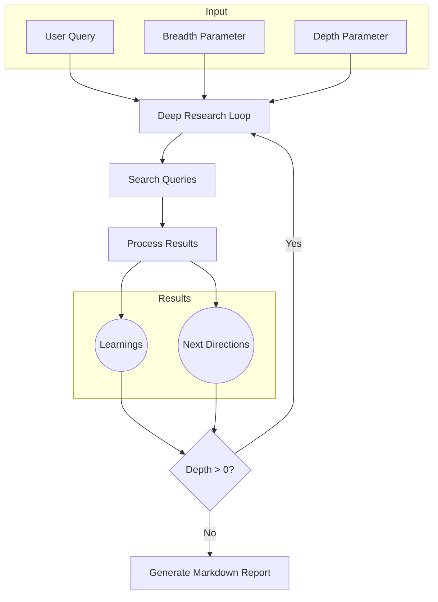

# Deep Research Agent

An AI-powered research assistant that performs iterative, deep analysis on any topic using LangGraph workflows. The agent autonomously generates search queries, extracts insights, and produces comprehensive research reports.

> **Inspired by**: This project is inspired by [dzhng/deep-research](https://github.com/dzhng/deep-research/) and reimagines the concept using LangGraph for more flexible workflow orchestration.

## Overview

Deep Research Agent uses a graph-based approach to conduct multi-layered research:

1. **Understanding**: Generates follow-up questions to clarify your research needs
2. **Query Generation**: Creates targeted search queries based on the research goal
3. **Information Gathering**: Executes searches and extracts relevant content
4. **Learning Extraction**: Analyzes results to extract key insights and learnings
5. **Iterative Deepening**: Identifies promising research directions and explores them recursively
6. **Report Generation**: Synthesizes all findings into a comprehensive markdown report

The agent uses **breadth** (number of queries per iteration) and **depth** (number of iterations) parameters to control research scope and thoroughness.

## Features

- 🔍 **Autonomous Research**: Self-directed exploration with minimal user input
- 🧠 **Smart Query Generation**: Creates diverse, targeted search queries using LLM reasoning
- 🔄 **Iterative Deepening**: Recursively explores promising research directions
- 📊 **Structured State Management**: Uses LangGraph for robust workflow orchestration
- 🌐 **Web Search Integration**: Powered by Firecrawl API for reliable content extraction
- 🤖 **Multi-LLM Support**: Compatible with Google Gemini, Groq, OpenAI, and Fireworks
- 📝 **Markdown Reports**: Generates well-formatted research reports with citations
- 🎨 **Interactive CLI**: Rich terminal interface with progress tracking
- ⚡ **Concurrent Processing**: Parallel search execution with configurable limits
- 🧪 **Testable Architecture**: Comprehensive test suite included

## How It Works

### Architecture

The system is built on **LangGraph**, a framework for creating stateful, multi-step LLM applications as directed graphs.



### Workflow Nodes

1. **Generate Queries Node**: Uses LLM to create diverse search queries based on:
   - Current research goal
   - Previous learnings (if any)
   - User's follow-up answers
   - Breadth parameter

2. **Search Node**: Executes concurrent searches using Firecrawl API
   - Fetches and extracts content from multiple sources
   - Handles rate limiting and errors gracefully

3. **Process Results Node**: Analyzes search results to:
   - Extract key learnings and insights
   - Identify gaps in current knowledge
   - Generate promising research directions
   - Rank directions by priority

4. **Prepare Next Node**: Sets up the next iteration:
   - Increments depth counter
   - Selects highest-priority research direction
   - Clears previous iteration data

5. **Generate Report Node**: Synthesizes all accumulated learnings into:
   - Structured markdown report
   - Cited sources
   - Key findings and conclusions

### State Management

The agent maintains a typed state object (`ResearchState`) that flows through the graph:

```python
ResearchState = {
    # Configuration
    "query": str,              # Original research question
    "breadth": int,            # Queries per iteration
    "depth": int,              # Maximum iterations
    "follow_up_answers": list, # User's clarifications
    
    # Progress tracking
    "current_depth": int,      # Current iteration number
    "current_goal": str,       # Current research focus
    
    # Accumulated data
    "learnings": list,         # All extracted insights
    "all_sources": list,       # All source documents
    "next_directions": list,   # Potential research paths
    
    # Per-iteration data
    "search_queries": list,    # Current queries
    "search_results": list,    # Current results
    
    # Output
    "final_report": str        # Generated report
}
```

### LLM Provider System

The agent supports multiple LLM providers with automatic priority resolution:

**Priority Order** (unless overridden):
1. Google Gemini (default)
2. Groq
3. Fireworks AI
4. OpenAI

**Provider Selection Logic**:
```
Environment Variable → Auto-detect API Keys → Default to Gemini
```

You can explicitly set the provider using `LLM_PROVIDER` environment variable:
```bash
LLM_PROVIDER=groq      # Use Groq
LLM_PROVIDER=openai    # Use OpenAI
LLM_PROVIDER=gemini    # Use Google Gemini
```

## Requirements

- **Python**: 3.10 or higher
- **API Keys**: 
  - **Required**: [Firecrawl API key](https://www.firecrawl.dev/) for web search and scraping
  - **At least one LLM provider**:
    - [Google AI Studio](https://aistudio.google.com/) (free tier available)
    - [Groq](https://console.groq.com/) (free tier available)
    - [OpenAI](https://platform.openai.com/)
    - [Fireworks AI](https://fireworks.ai/)

## Setup

### 1. Clone the Repository

```bash
git clone <repository-url>
cd deep-research
```

### 2. Run Setup Script (Automated)

```bash
chmod +x setup.sh
./setup.sh
```

This will:
- Verify Python version
- Create a virtual environment
- Install all dependencies
- Create `.env` file template
- Create reports directory
- Run tests

### 3. Configure Environment Variables

Create a `.env` file in the project root:

```bash
# Required: Firecrawl API
FIRECRAWL_API_KEY=your_firecrawl_api_key

# Required: At least ONE of the following LLM providers

# Google Gemini (Recommended - Free tier available)
GOOGLE_API_KEY=your_google_api_key

# Groq (Alternative - Free tier available)
GROQ_API_KEY=your_groq_api_key

# OpenAI (Alternative)
OPENAI_API_KEY=your_openai_api_key

# Fireworks AI (Alternative)
FIREWORKS_API_KEY=your_fireworks_api_key

# Optional: Override default provider
# LLM_PROVIDER=gemini  # Options: gemini, groq, openai, fireworks

# Optional: Custom model override
# CUSTOM_MODEL=gemini-2.5-flash

# Optional: Custom OpenAI-compatible endpoint
# OPENAI_ENDPOINT=https://your-custom-endpoint.com/v1
```

### 4. Manual Setup (Alternative)

If you prefer manual setup:

```bash
# Create virtual environment
python3 -m venv venv
source venv/bin/activate  # On Windows: venv\Scripts\activate

# Install dependencies
pip install -r requirements.txt

# Create .env file (see step 3)
touch .env

# Create reports directory
mkdir -p reports
```

## Usage

### Interactive CLI

The recommended way to use the agent is through the interactive command-line interface:

```bash
# Activate virtual environment if not already activated
source venv/bin/activate

# Run the CLI
python run.py
```

The CLI will guide you through:
1. **Research Query**: What you want to research
2. **Breadth**: Number of search queries per iteration (recommended: 3-10)
3. **Depth**: Number of research iterations (recommended: 1-5)
4. **Follow-up Questions**: AI-generated clarifying questions
5. **Confirmation**: Review settings before starting

### Programmatic Usage

You can also use the agent programmatically in your Python code:

```python
import asyncio
from deep_research import DeepResearchAgent

async def main():
    # Initialize agent
    agent = DeepResearchAgent(
        breadth=4,  # 4 queries per iteration
        depth=2,    # 2 iterations deep
    )
    
    # Run research
    result = await agent.run_async(
        query="What are the latest developments in quantum computing?",
        skip_follow_up=True  # Skip follow-up questions
    )
    
    # Access results
    print("Report:", result["final_report"])
    print("Learnings:", len(result["learnings"]))
    print("Sources:", len(result["sources"]))
    
    # Save report
    await agent.save_report(
        report=result["final_report"],
        filename="quantum_computing_report.md"
    )

# Run
asyncio.run(main())
```

### Configuration Parameters

| Parameter | Type | Default | Description |
|-----------|------|---------|-------------|
| `breadth` | int | 4 | Number of search queries generated per iteration |
| `depth` | int | 2 | Maximum number of research iterations |
| `concurrency_limit` | int | 3 | Maximum concurrent search requests |

**Recommended Configurations**:

- **Quick Overview** (fast, broad): `breadth=5, depth=1`
- **Balanced Research** (recommended): `breadth=4, depth=2`
- **Deep Dive** (thorough, slower): `breadth=6, depth=3`
- **Exhaustive** (very thorough): `breadth=8, depth=4`


## Project Structure

```
deep-research/
├── deep_research/              # Main package
│   ├── __init__.py
│   ├── agent.py               # Main agent class
│   ├── graph.py               # LangGraph workflow definition
│   ├── state.py               # State management and types
│   ├── nodes/                 # Workflow nodes
│   │   ├── __init__.py
│   │   ├── generate_queries.py
│   │   ├── search.py
│   │   ├── process_results.py
│   │   └── generate_report.py
│   ├── tools/                 # External integrations
│   │   ├── __init__.py
│   │   ├── firecrawl.py      # Web search/scraping
│   │   └── llm.py            # LLM provider management
│   └── utils/                 # Utilities
│       ├── __init__.py
│       ├── prompts.py        # LLM prompts
│       └── formatting.py     # Text formatting
├── tests/                     # Test suite
│   ├── __init__.py
│   └── test_agent.py
├── run.py                     # CLI entry point
├── setup.sh                   # Setup script
├── requirements.txt           # Python dependencies
├── .env                       # Environment variables (create this)
├── .gitignore
└── README.md
```

## Development

### Running Tests

```bash
# Activate virtual environment
source venv/bin/activate

# Run all tests
pytest tests/ -v

# Run with coverage
pytest tests/ --cov=deep_research --cov-report=html
```

### Visualizing the Graph

You can visualize the LangGraph workflow (requires graphviz):

```bash
pip install pygraphviz

python -c "from deep_research.graph import visualize_graph; visualize_graph()"
```

This generates `research_graph.png` showing the node structure and edges.

### Adding Custom Nodes

To extend the workflow:

1. Create a new node function in `deep_research/nodes/`:
```python
async def my_custom_node(state: ResearchState) -> dict:
    # Process state
    return {"state_key": updated_value}
```

2. Add the node to the graph in `deep_research/graph.py`:
```python
workflow.add_node("my_node", my_custom_node)
workflow.add_edge("previous_node", "my_node")
```

## Troubleshooting

### API Key Issues

**Problem**: `FIRECRAWL_API_KEY not found`
- **Solution**: Ensure `.env` file exists and contains valid API key
- **Check**: Run `cat .env | grep FIRECRAWL_API_KEY`

**Problem**: `No LLM API key found`
- **Solution**: Add at least one LLM provider API key to `.env`
- **Recommendation**: Start with Google Gemini (free tier available)

### Installation Issues

**Problem**: Python version error
- **Solution**: Ensure Python 3.10+ is installed: `python3 --version`

**Problem**: Package installation fails
- **Solution**: Upgrade pip: `pip install --upgrade pip`

### Performance Issues

**Problem**: Research taking too long
- **Solution**: Reduce depth parameter or breadth
- **Example**: Use `breadth=3, depth=1` for faster results

**Problem**: Rate limiting errors
- **Solution**: Reduce `concurrency_limit` in agent initialization

## Credits

This project is inspired by and builds upon concepts from:
- **[dzhng/deep-research](https://github.com/dzhng/deep-research/)** - Original deep research implementation

### Technologies Used

- **[LangGraph](https://github.com/langchain-ai/langgraph)** - Workflow orchestration
- **[LangChain](https://github.com/langchain-ai/langchain)** - LLM integration framework
- **[Firecrawl](https://www.firecrawl.dev/)** - Web search and content extraction
- **[Google Gemini](https://ai.google.dev/)** - Default LLM provider
- **[Pydantic](https://docs.pydantic.dev/)** - Data validation and settings management
- **[Rich](https://rich.readthedocs.io/)** - Terminal formatting

## License
MIT License - feel free to use and modify as needed.

This project is open source. Please check the original [deep-research](https://github.com/dzhng/deep-research/) repository.

---

**Happy Researching! 🔬**
